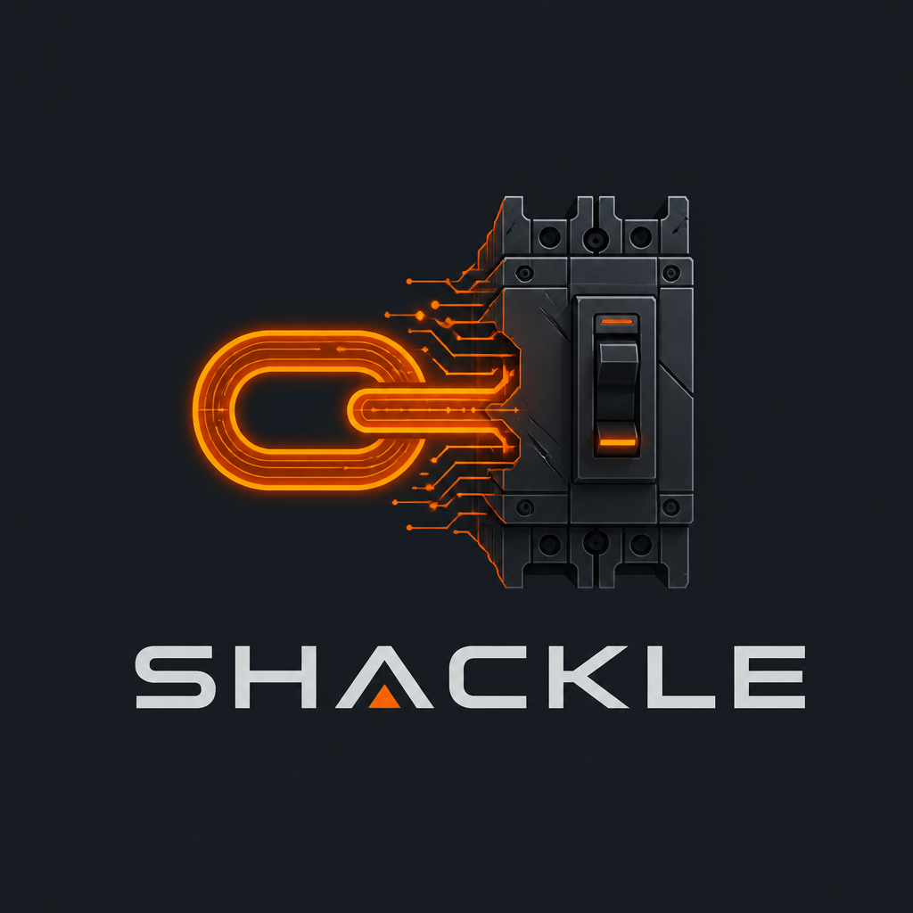

#  ⛓️ SHACKLE

[](https://www.gnu.org/licenses/agpl-3.0)
[](https://www.python.org/downloads/)

> **The 1-Line Runtime Circuit Breaker for Autonomous AI Agents.**
> Stop runaway token loops, unhandled tool cascades, and accidental $4,000 API bills before they happen.

---

## Provenance

SHACKLE was built by **Dante Bullock**, a 52-year-old self-taught systems architect and
engineer out of Oakland, California. No venture capital. No corporate incubator.
Just raw necessity and a refusal to watch autonomous agents burn money in
silent infinite loops.

Rather than guessing what the agent ecosystem needed, Sovereign Logic used
real-time web scraping and community sentiment mining to audit the issue
trackers of CrewAI, AutoGen, and LangGraph — mapping the exact systemic
failures affecting developers in production, then building the drop-in
circuit breaker to fix them.

This is infrastructure built by a developer, for developers — sovereign,
lean, and zero-bloat.

---

## 🎯 When to Use SHACKLE

**SHACKLE is purpose-built for:**
- **Local development and debugging** — Interactive HITL console gives you real-time control
- **CLI agents and supervised workflows** — Resume/Skip/Abort when loops are detected
- **Cross-framework coverage** — One decorator works across CrewAI, LangGraph, and AutoGen
- **Budget enforcement** — Client-side token tracking prevents runaway costs
- **Iterative testing** — Catch loops early in the development cycle

**For headless production APIs** (serverless functions, FastAPI endpoints, background workers where blocking for human input isn't an option), consider framework-native solutions like [TokenCircuit](https://github.com/) for automated LangGraph overrides.

SHACKLE and production-oriented tools solve complementary problems: use SHACKLE during development and testing, then transition to automated overrides for deployed APIs if needed.

---

## ⚡ The Problem

AI agents are highly capable, but their error-handling is fundamentally broken. When an agent hits an unhandled tool error (401 Unauthorized, changed API payload, dead endpoint), it rarely self-corrects. Instead, it enters a **"Loop of Death"** — retrying the exact same tool with the exact same input, burning your context window and running up massive API bills in minutes.

Frameworks like **CrewAI**, **AutoGen**, and **LangGraph** lack native, framework-agnostic spending guardrails or deterministic loop breakers.

## 🛡️ The Solution

SHACKLE is a lightweight, zero-dependency governance layer that sits inside your runtime via dynamic Python shims. It intercepts **LLM calls** and **tool executions** client-side, monitoring execution state deterministically.

When an agent breaches your boundaries, SHACKLE trips the circuit breaker, halts execution, and drops you into an interactive terminal console.

### Key Features

- **1-Line Install** — no refactoring your agent topology
- **Loop of Death Prevention** — detects identical sequential tool calls and error cascades
- **Budget Enforcement** — real-time token tracking against a client-side pricing table
- **Execution Timeouts** — prevents hung threads on dead APIs
- **HITL Console** — interactive terminal with Resume / Skip / Abort options
- **100% Client-Side** — no telemetry, no phone-home, no hidden SaaS

---

## 🚀 Quick Start

### 1. Install

> **Note:** the PyPI release is being published. Until `pip install shackle-guard`
> is live, install directly from source (works today):

```bash
# From source (available now)
git clone https://github.com/Fame510/SHACKLE.git
cd SHACKLE
pip install -e .

# Or, once published to PyPI:
pip install shackle-guard
```

### 2. Guard Your Workflow

```python
from shackle import Guard
from crewai import Crew, Agent, Task

# Your normal CrewAI setup
my_crew = Crew(agents=[...], tasks=[...])

# One line to add circuit breaking
@Guard(budget=0.25, max_repeat_calls=3, timeout_seconds=180)
def run():
    return my_crew.kickoff()

run()
```

That's it. SHACKLE dynamically hooks the underlying interpreters — no CrewAI source changes needed.

---

## ⚙️ The Four Circuit Breakers

| Trigger | Condition | Default | What Happens |
|---|---|---|---|
| **REPETITIVE_TOOL_CALL** | Same tool + same input called N times, or input contains error signals | 3 attempts | Drops to HITL console |
| **BUDGET_EXCEEDED** | Accumulated token cost exceeds limit (via local pricing table) | $0.20 | Hard execution freeze |
| **TIMEOUT_REACHED** | Wall-clock execution exceeds threshold | 180 seconds | Immediate halt |
| **MAX_TOOL_CALLS** | Total tool invocations exceed limit | 50 calls | Hard stop |

### Error Loop Amplification

SHACKLE **amplifies sensitivity** when tool inputs contain error signals (`401`, `500`, `timeout`, `unauthorized`, etc.) — catching the "I'll just try again" loop before the agent burns tokens on a permission error it can't fix.

---

## 🛠️ The HITL Console

When a breaker trips, SHACKLE renders an interactive terminal:

```
⛓️ SHACKLE CIRCUIT BREAKER: REPETITIVE_TOOL_CALL

Agent:         ResearchAgent
Tool:          web_search
Input:         {"query": "latest AI news", "error": "401 Unauthorized"}
Call Count:    3x
━━━ Session Stats ━━━
Tokens:        In: 8,400 | Out: 1,200
Session Cost:  $0.02850
Time Running:  47.2s

Options:
  [R] Resume/Reset — clear history, continue execution
  [S] Skip — return dummy output, attempt context flush
  [A] Abort — hard terminate the current run

Select action (R/S/A):
```

---

## 🔌 Works With

| Framework | Support | Notes |
|---|---|---|
| **CrewAI** | ✅ Full | litellm hook + BaseTool hook + Agent.execute_task (experimental) |
| **LangChain / LangGraph** | ✅ Full | litellm + BaseTool hooks cover all paths |
| **AutoGen** | ✅ Full | litellm interception catches all LLM calls |
| **Smolagents** | 🧪 Experimental | Manager Agent reasoning loop detection active |

---

## 🚀 V2: Enterprise Runtime Sovereignty Layer (Optional)

For production deployments requiring **distributed state**, **compliance audit logs**, or **remote agent control**, see **[v2/README.md](v2/README.md)**.

**V2 adds:**
- ✅ Distributed budget tracking (across serverless functions, Lambda, K8s)
- ✅ Postgres audit logs (cryptographically signed, SOC2-ready)
- ✅ Remote HITL control (manage headless agents from mobile/web)
- ✅ Commercial licensing (for closed-source products)

**V1 (this)** is always free and perfect for local development. **V2** is an optional upgrade for enterprise production use.

---

## 🔮 Roadmap

- [x] Budget enforcement (client-side pricing table)
- [x] Loop of Death detection (repeat tool calls + error amplification)
- [x] HITL terminal interface (Resume / Skip / Abort)
- [x] Execution timeout guard
- [x] **V2: Distributed state engine** (Redis + Postgres)
- [x] **V2: SOC2 compliance pack** (cryptographic audit logs)
- [ ] `.shackle.yaml` config file support
- [ ] Webhook mode for async HITL (instead of CLI)
- [ ] Multi-agent cost attribution dashboard (Pro)
- [ ] Slack / PagerDuty alerts (Pro)

---

## 💰 Commercial Licensing

SHACKLE is open-source under **AGPLv3** — free for individual developers,
hobbyists, and open-source projects. If you're using SHACKLE in a closed-source
commercial product, SaaS platform, or enterprise deployment, the AGPLv3
requires you to open-source your entire application. Most companies don't
want to do that — so they purchase a commercial license instead.

### What a Commercial License Gets You

| | AGPLv3 (Free) | Commercial License |
|---|---|---|
| Use in closed-source products | ❌ | ✅ |
| White-label / rebrand | ❌ | ✅ |
| No copyleft obligations | ❌ | ✅ |
| Priority support | Community | SLA-backed |
| Custom integration assistance | Self-serve | Architecture audit |

### Licensing Options

Commercial licensing is available for:
- **Developer / Startup teams** shipping closed-source agent products
- **Enterprise deployments** requiring on-prem, SOC2 compliance, or SLA support
- **Framework companies** (CrewAI, LangGraph, etc.) wanting white-label integration

Pricing is customized based on your needs, team size, and deployment scale.

📧 **Contact for pricing:** docspoc101@gmail.com

---

## ⚠️ Disclaimer of Liability

THE SOFTWARE IS PROVIDED "AS IS", WITHOUT WARRANTY OF ANY KIND, EXPRESS OR
IMPLIED, INCLUDING BUT NOT LIMITED TO THE WARRANTIES OF MERCHANTABILITY,
FITNESS FOR A PARTICULAR PURPOSE AND NONINFRINGEMENT. IN NO EVENT SHALL THE
AUTHORS OR COPYRIGHT HOLDERS BE LIABLE FOR ANY CLAIM, DAMAGES OR OTHER
LIABILITY, WHETHER IN AN ACTION OF CONTRACT, TORT OR OTHERWISE, ARISING FROM,
OUT OF OR IN CONNECTION WITH THE SOFTWARE OR THE USE OR OTHER DEALINGS IN THE
SOFTWARE.

BY USING THIS SOFTWARE, YOU ACKNOWLEDGE THAT LLM ORCHESTRATION IS INHERENTLY
NON-DETERMINISTIC. SHACKLE IS A BEST-EFFORT CIRCUIT BREAKER AND DOES NOT
GUARANTEE PREVENTING ALL API SPEND OVERRUNS. YOU REMAIN SOLELY RESPONSIBLE FOR
MONITORING YOUR OWN API LIMITS AND USAGE BILLS.

## 📄 License

Copyright (C) 2026 Dante Bullock, Sovereign Logic.

Licensed under the GNU Affero General Public License v3.0 (AGPLv3).
See [LICENSE](LICENSE) for full terms.

**Using SHACKLE in a closed-source product?**
[Contact us](mailto:docspoc101@gmail.com) for commercial licensing.

---

## 👤 Creator

**Dante Bullock** — 52-year-old self-taught systems architect from Oakland, California.
Founder of Sovereign Logic. Built SHACKLE out of raw necessity after watching
autonomous agents burn thousands in silent API loops with no native circuit
breaker in sight.

> *"I don't wait for VC validation. I scrape issue trackers, find the bleeding,
> and build the tourniquet."*

GitHub: [@Fame510](https://github.com/Fame510)
Contact: docspoc101@gmail.com

---

## 🤝 Contributing

### Pricing Table Updates

As model providers update pricing, submit PRs to `shackle/core.py` → `MODEL_PRICING`. Contributors who submit verified pricing updates get credited in release notes.

### Adding Framework Hooks

SHACKLE's architecture supports pluggable runtime hooks. To add support for a new framework:

1. Add a `_patch_<framework>()` function following the pattern in `core.py`
2. Register it in `_apply_patches()`
3. Submit a PR with integration tests

---

## 💼 Commercial Support (optional)

SHACKLE is free and open source (AGPLv3). If you want hands-on help deploying it
in your stack, paid implementation and architecture-audit support is available.

**I fix this. Today.**

If your CrewAI / LangGraph / AutoGen agents are burning money in loops and you
need a solution deployed by someone who understands the internals — not a generic
consultant who'll Google "what is CrewAI" on your dime:

📧 **docspoc101@gmail.com**

### 💳 Ready to Start? Pay Here

**[→ Pay $2,500 — SHACKLE Implementation + Architecture Audit ←](https://buy.stripe.com/6oU28q54DbsXdpV6Hy9sk00)**

*After payment, email docspoc101@gmail.com with your repo link. I'll respond
within 4 hours to schedule your architecture audit.*

**What you get:**
- Architecture audit of your agent topology
- Custom SHACKLE configuration for your specific models and tools
- Integration with your existing codebase (one decorator, zero refactors)
- 30-day guarantee: if SHACKLE doesn't catch a loop in 30 days, I fix it free

Most clients recover this cost in their first two weeks of API savings.
Serious inquiries only. You'll speak directly to the engineer who built it.

